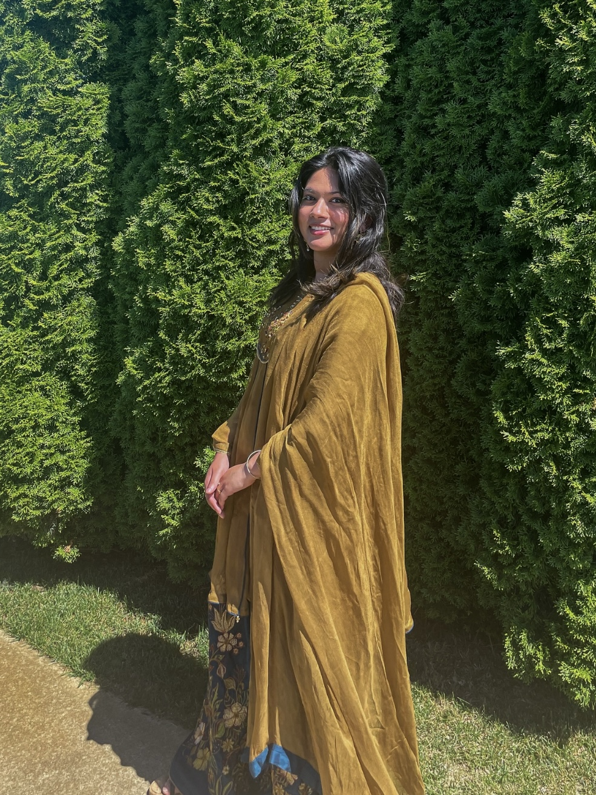
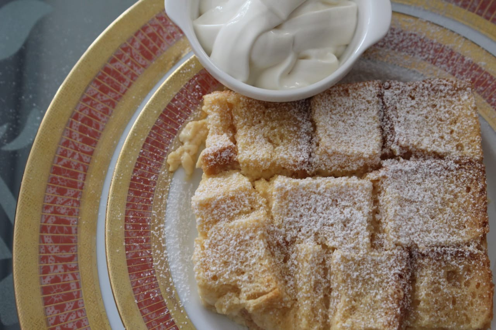
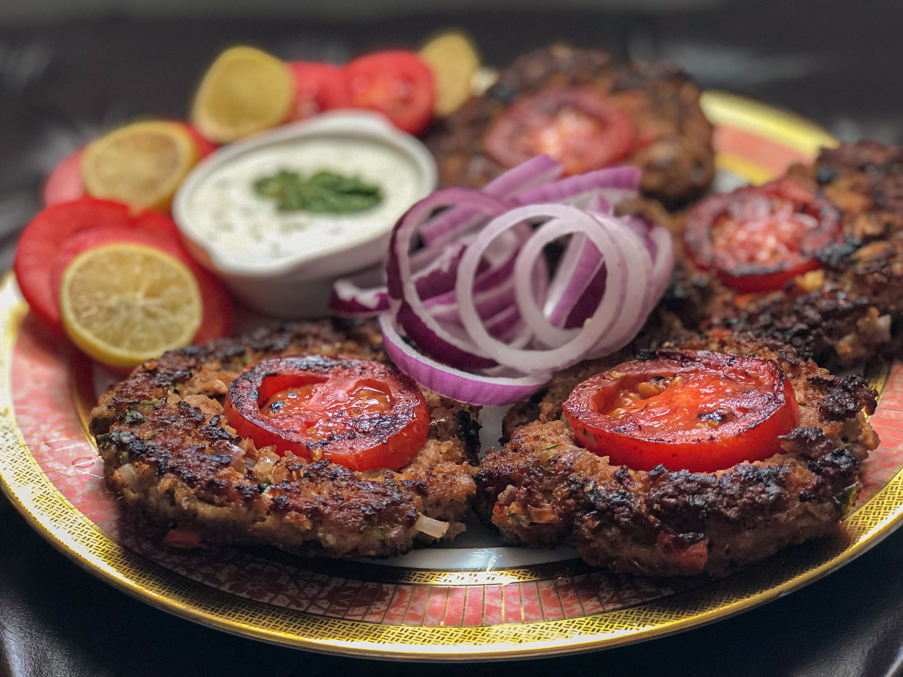
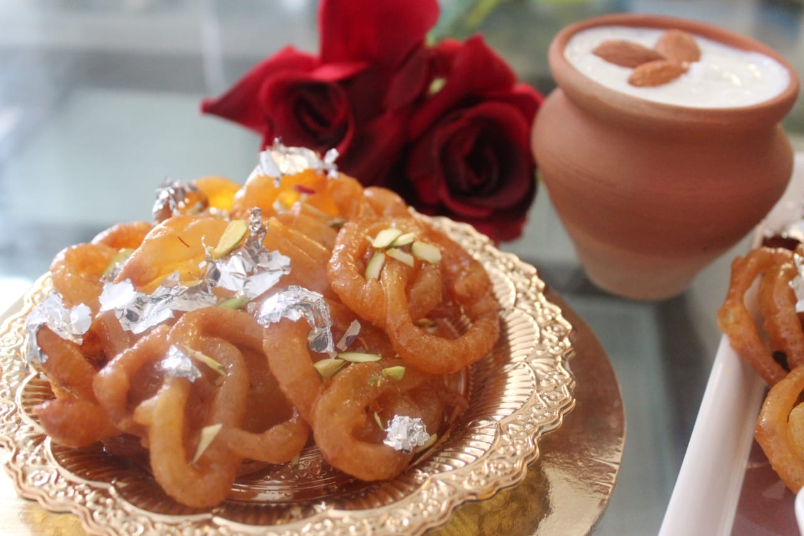

    

## Hello there!
My name is Shanze Owais, and I am a passionate and dedicated data science major with a deep interest in uncovering insights through data. Currently, I am pursuing my degree at Michigan State University. Throughout my studies, I have developed a strong foundation in statistical analysis and data visualization. My academic journey has equipped me with proficiency in tools and languages such as Python, Java, SQL, NumPy, and Seaborn, allowing me to tackle complex data-driven challenges. 

I recently switched majors to data science, which is why I am still building my experience in this field. However, I have valuable experience working in other jobs that have honed my problem-solving, teamwork, and communication skills. These roles have prepared me to adapt quickly and apply my knowledge effectively.

I thrive on solving challenging problems and have worked on diverse projects that demonstrate my ability to apply theoretical knowledge to real-world scenarios. From predicting the spread of COVID-19 to analyzing climate change patterns, my work is driven by a commitment to accuracy, impact, and positive change. 

Beyond my technical skills, I am an effective communicator and a collaborative team player. I am eager to connect with fellow data enthusiasts and explore opportunities that challenge me to grow and make meaningful contributions to the field of data science.

Outside of academia and data science, I enjoy exploring photography, hiking, and experimenting with new recipes in the kitchen. Below, you can view some of my photography showcasing the dishes I've prepared. These personal interests complement my analytical mindset and contribute to my holistic approach to life and problem-solving.

    
    
    

